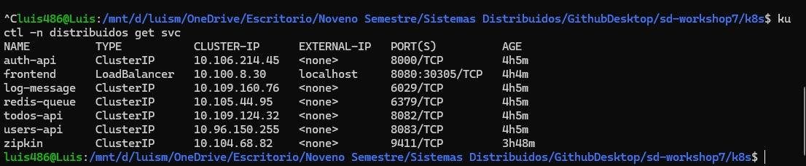
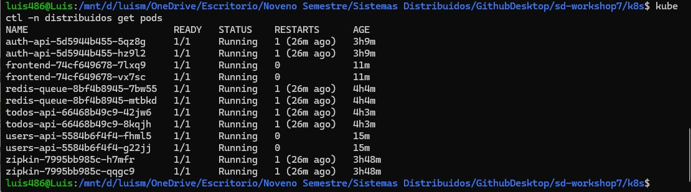
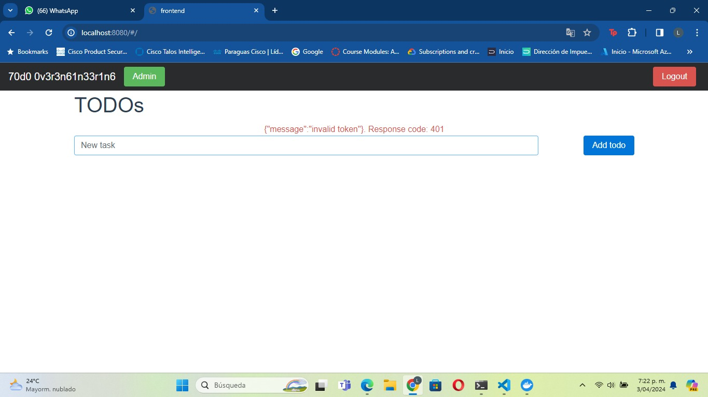

### Workshop 7
**Universidad ICESI**  


### Team

* Nicolás Gómez 
* Luis Murcia

### Suggested technologies 
* WSL
* Ubuntu
* Docker Desktop
* Kubernetes
  
# Code:
First of all we created a deployment for each microservice needed for this app to work.

```
apiVersion: apps/v1
kind: Deployment
metadata:
  name: frontend
  namespace: distribuidos  
spec:
  replicas: 2
  selector:
    matchLabels:
      app: frontend
  template:
    metadata:
      labels:
        app: frontend
    spec:
      containers:
      - name: frontend
        image: luis486/frontend:latest
        ports:
        - containerPort: 8080
        env:
        - name: PORT
          value: "8080"
        - name: AUTH_API_ADDRESS
          value: "http://auth-api:8000"
        - name: TODOS_API_ADDRESS
          value: "http://todos-api:8082"
``` 
Then, we created a namespace to visualize the microservices
Finally we apply this code for each yaml file:
```
example: kubectl -n distribuidos apply -f frontend
```

#### Note: 

Because we have been using Docker desktop and didn't install minikube, we need to port forward from the local machine to a virtual environment with this code

In this case the frontend service
kubectl -n distribuidos port-forward *name-pod* 8888:8080

# Service cluster:
<br>
Here we observe each created server to support the group if microservices that are joint in a cluster

# K8's pods:
<br>
Over her we've got the k8's pods where the microservices are running, every one of them with it's replica
# Working program:
<br>


