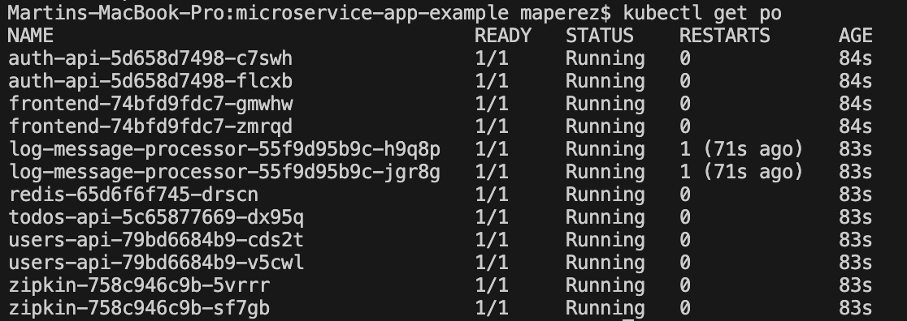
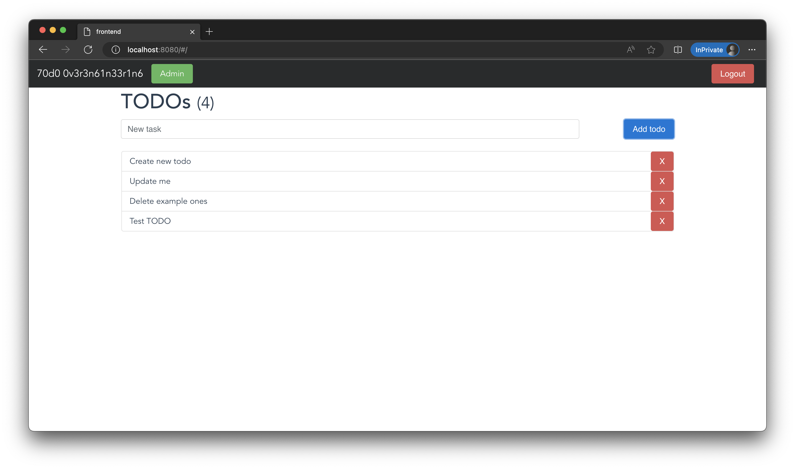

# sd-workshop7

Arturo Diaz & Martin Perez

1. Created containers for each microservice. Images have been pused into docker hub. Tags:
⋅⋅* maperez1225/microservice-example-logs
⋅⋅* maperez1225/microservice-example-front
⋅⋅* maperez1225/microservice-example-todos
⋅⋅* maperez1225/microservice-example-users
⋅⋅* maperez1225/microservice-example-auth
2. Created YML files for each deployment and service, specifying replicas, image, ports and environment variables. Frontend service was deployed with loadbalancer and assigned external port 8080. See [YML](frontend.yml).
3. Executed Kubernetes engine and ran the following command in project root directory: `kubectl apply -f .`

Pods running:

Frontend running:
