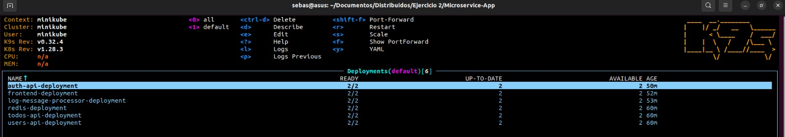
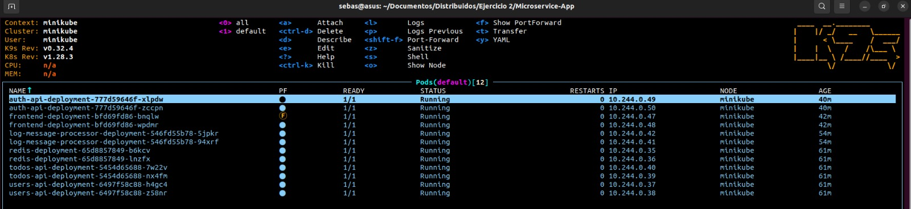
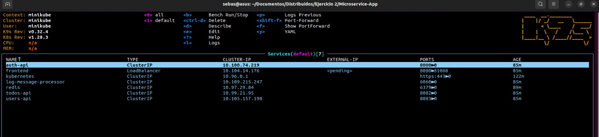
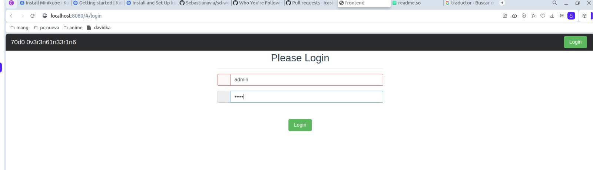
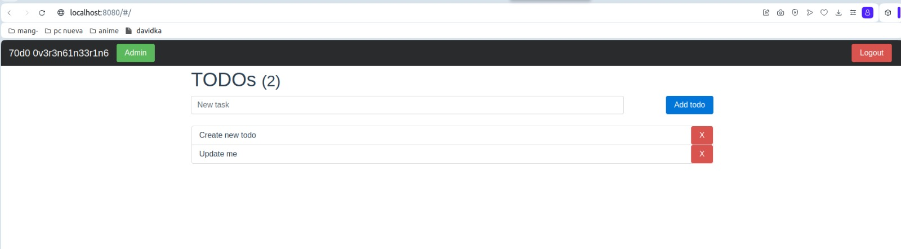
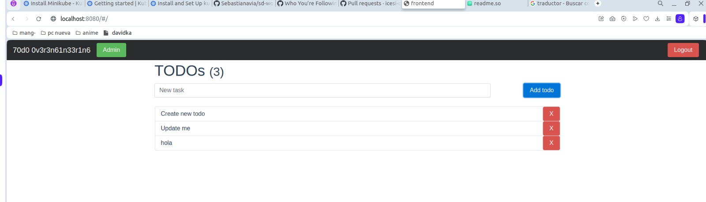

# sd-workshop7
### contributors
Sebastian Navia

Amilcar Steban

# Kubernetes Microservices Project

This project aims to deploy a set of microservices in a Kubernetes cluster. The microservices included in this project are as follows:


- frontend: Main user interface.

- auth-api: User authentication service.

- log-message-processor: Log message processor.

- todos-api: API for managing to-do tasks.

- users-api: API for managing users.

for each of the above microservices, we need to create different deployment files:

The Deployment configuration files in Kubernetes describe how applications should be deployed and scaled within a Kubernetes cluster. These files specify details such as the container image to use, the number of application replicas to be run, and how network and storage resources should be configured. The main goal of Deployments is to automate and manage the deployment of applications in a consistent, scalable, and reliable manner. By defining a Deployment, the aim is to achieve a robust and seamless implementation of applications, enabling easy scalability, automatic failure recovery, and continuous updating of applications in a Kubernetes environment.

you'll find YAML files needed to deploy each microservice in the Kubernetes cluster:

## Configuration and Deployment

To deploy the microservices in your Kubernetes cluster, follow these steps:

1. Make sure you have `kubectl` installed to interact with the Kubernetes cluster.

2. Create the deployment files according to your needs, in this case we will use 2 replicaset for each service and all deployments will have a ClusterIP service type except the frontend which will be of LoadBalancer type.

3. Use the following commands to deploy each microservice:

```bash
kubectl apply -f kubernetes/frontend.yaml
kubectl apply -f kubernetes/auth-api.yaml
kubectl apply -f kubernetes/log-message-processor.yaml
kubectl apply -f kubernetes/todos-api.yaml
kubectl apply -f kubernetes/users-api.yaml
kubectl apply -f kubernetes/redis.yaml
```
4. Verify that the deployment, pods and services are running correctly.
```
  kubectl get deployments
```
<p align="left">
  
</p

```
  kubectl get pods
```
<p align="left">
  
</p

```
  kubectl get services
```
<p align="left">
  
</p

In this way we have our microservices running correctly in the kubernetes cluster, now let's check that everything is working correctly:

log in with the credentials 'admin' and 'admin':
<p align="left">
  
</p

Now, we have the following interface, we write a text in the empty field and push add todo:
<p align="left">
  
</p

We text is add in the interface:
<p align="left">
  
</p

that would be the whole process in this case, clearly all this can be modified much more depending on the context.
