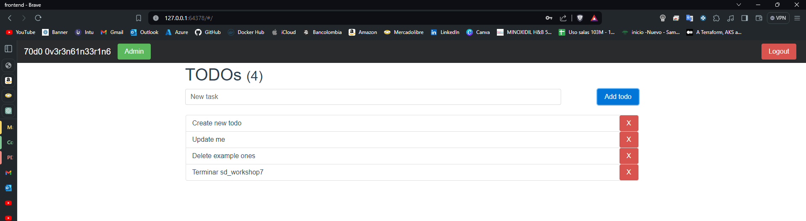

# Microservice App

### Team

 * [Paula Trujillo](https://github.com/PaulaTrujillo27)
 * [Jhorman Mera](https://github.com/JhormanMera)

## Description

You will find a basic TODO application designed with a [microservice architecture](https://microservices.io). Although is a TODO application, it is interesting because the microservices that compose it are written in different programming language or frameworks (Go, Python, Vue, Java, and NodeJS). With this design you will experiment with multiple build tools and environments. 

## Components
In each folder you can find a more in-depth explanation of each component:

1. [Users API](/users-api) is a Spring Boot application. Provides user profiles. At the moment, does not provide full CRUD, just getting a single user and all users.
2. [Auth API](/auth-api) is a Go application, and provides authorization functionality. Generates [JWT](https://jwt.io/) tokens to be used with other APIs.
3. [TODOs API](/todos-api) is a NodeJS application, provides CRUD functionality over user's TODO records. Also, it logs "create" and "delete" operations to [Redis](https://redis.io/) queue.
4. [Log Message Processor](/log-message-processor) is a queue processor written in Python. Its purpose is to read messages from a Redis queue and print them to standard output.
5. [Frontend](/frontend) Vue application, provides UI.

## Architecture

Take a look at the components diagram that describes them and their interactions.

## Deployment

### Requirements

It is necessary to have Docker and either kubectl or minikube installed for this development.

* [Install docker](https://www.docker.com/products/docker-desktop/)
* [Install minikube](https://minikube.sigs.k8s.io/docs/start/)
* [Install kubectl](https://kubernetes.io/docs/tasks/tools/)
* If you don't have the Docker images of the applications, it's necessary to create them while being inside each application's directory using the command `docker build -t "docker-user"/"image-name":"image-tag" .` Afterward, to publish them to a Docker Hub repository, you can use the command `docker push "docker-user"/"image-name":"image-tag"`. Those images will be used in the creation of pods within the cluster for each of the applications.

In Windows, you can enable kubectl integration from the Docker Desktop interface. This is done by:
1. Going to Settings 
2. Kubernetes Menu
3. Clicking Enable Kubernetes
4. Apply and restart.

### Step By Step

To run this application, you should follow these steps:

* Having a [configuration file](./k8s/services.yml) that will provision the application's services.

* If you are using Minikube, you need to use the command `minikube start` to initialize the cluster. If you are using kubectl, you can skip this step.

* Inside the folder where the configuration file is located, you should execute the command `kubectl apply -f "file.yml"`.

*  We check the status of the pods using the command `kubectl get pods`.

* If you are using Minikube, you need to run the command `minikube service "service-name"` (in this case, it would be the service that contains the frontend) as this command allows you to access a service within your Minikube cluster from your local machine through a tunnel. This is useful for testing and developing applications running on Kubernetes without exposing them to the outside world.

* If you are not using Minikube, you need to use the command `kubectl port-forward service/"service-name" machine_port:cluster_port`. When you execute this command, you're creating a network tunnel from your local machine to the specified service within your Kubernetes cluster. This allows you to access the service as if it were running locally on your machine, using the specified local port (8888 in this case).

* To delete the entire deployment, you need to use the command `kubectl delete -f "file.yml"`

* To stop the Minikube node, you use the command `minikube stop`

## App Running

To access the application, you should use the credentials 
* username: admin 
* password: admin.